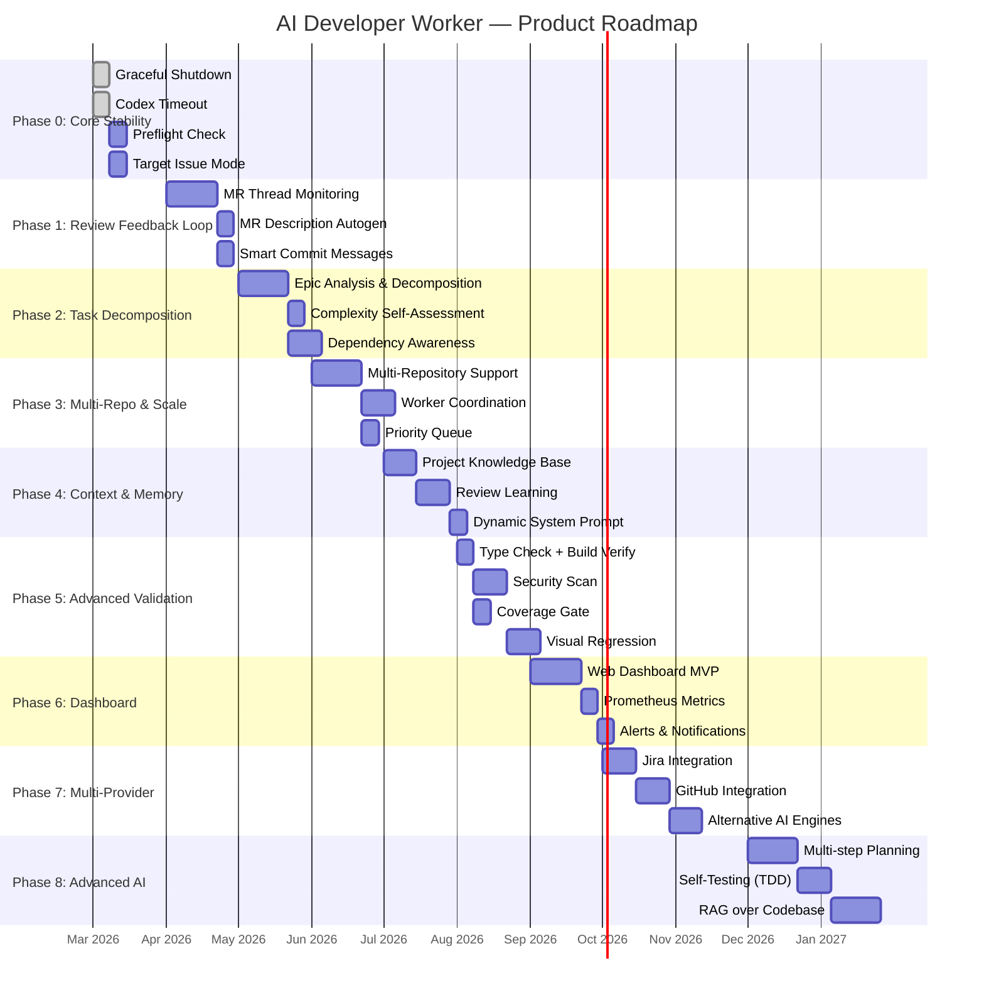
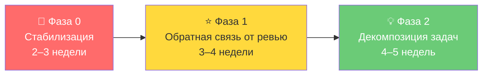

# Product Roadmap — AI Developer Worker

## Видение продукта

**Сейчас:** Однопроцессный воркер, который берёт задачу из Tracker → просит Codex реализовать → прогоняет тесты → создаёт MR.

**Куда двигаться:** Автономная платформа AI-разработки, которая встраивается в полный цикл DevOps — от декомпозиции эпиков до пост-деплой мониторинга, с обучением на обратной связи и поддержкой множественных репозиториев.

---

## Фаза 0 — Стабилизация ядра  
*~2–3 недели*

> [!IMPORTANT]
> Без этих пунктов продукт нельзя эксплуатировать в production-режиме с доверием.

### 0.1 Graceful Shutdown
Обработка `SIGTERM`/`SIGINT` с завершением текущего цикла до остановки. Без этого `docker stop` оставляет задачу в неконсистентном состоянии.

### 0.2 Codex Timeout
Ограничение времени выполнения `codex exec`. Настройка через `CODEX_TIMEOUT_SECONDS`. Защита от зависания.

### 0.3 Preflight Check
Команда `--preflight`, которая проверяет доступность Tracker API, GitLab API, валидность статус-маппинга, работоспособность git remote, запускаемость `testCommand` и `lintCommand` — до начала обработки задач.

### 0.4 Target Issue Mode
`TARGET_ISSUE_KEY=FRONTEND-42` — явное указание задачи для обработки. Критично для отладки и ручного запуска.

---

## Фаза 1 — Обратная связь от код-ревью  
*~3–4 недели*

> Сейчас воркер создаёт MR и забывает о нём. Это самое узкое место: ревьюер оставляет замечания → никто их не обрабатывает → MR висит вечно.

### 1.1 Мониторинг MR-треда

Воркер периодически проверяет комментарии к MR через GitLab API. Если обнаруживает unresolved discussions (замечания ревьюера):
- Парсит замечания, группирует по файлам
- Строит промпт с контекстом diff + замечания
- Запускает Codex для итеративного исправления
- Пушит обновлённый код, комментирует в тред MR

```
Новый логический статус: "fixing_review"
Цикл: review → fixing_review → review → ... → done/merged
```

### 1.2 MR Description автогенерация

Вместо простого `[AI] FRONTEND-123 implementation` — генерировать:
- **Summary** — что изменено и зачем
- **Changed files** — группированный список с аннотациями
- **Testing** — какие тесты прошли, какие добавлены
- **Screenshots** — если задача визуальная (через headless browser)

Это одна из самых заметных фич с точки зрения ревьюера:
```typescript
interface MergeRequestContent {
  title: string;
  description: string;  // сгенерированный markdown
  labels: string[];
  assignees?: number[];
}
```

### 1.3 Smart Commit Messages

Вместо `feat: implement FRONTEND-123` — осмысленные conventional commits:
- `feat(auth): add JWT token refresh on 401 response [FRONTEND-123]`
- Если несколько логических изменений — несколько коммитов

---

## Фаза 2 — Декомпозиция задач  
*~4–5 недель*

> Сейчас воркер умеет обрабатывать только атомарные задачи. Крупные задачи (эпики, фичи) требуют предварительной декомпозиции, которую делает человек.

### 2.1 Анализ и декомпозиция эпика

Новый режим: `TASK_MODE=decompose`. Воркер получает крупную задачу и:
1. Анализирует описание + кодовую базу
2. Создаёт набор подзадач (sub-issues) в Tracker
3. Расставляет зависимости между подзадачами
4. Оценивает сложность каждой

```
Эпик FRONTEND-100 "Реализовать систему уведомлений"
  → FRONTEND-101 "Создать модель Notification"
  → FRONTEND-102 "API-эндпойнты для уведомлений" (зависит от 101)
  → FRONTEND-103 "WebSocket-канал real-time уведомлений" (зависит от 102)
  → FRONTEND-104 "UI-компонент NotificationBell" (зависит от 103)
```

### 2.2 Самооценка сложности

Перед началом реализации воркер оценивает задачу:
- **Confidence score** (0–100%) — насколько уверен, что справится
- **Estimated changes** — примерное количество файлов / строк
- **Risk factors** — что может пойти не так

Если confidence < порога → задача отмечается как `needs_human_decomposition`.

### 2.3 Зависимости между задачами

Воркер учитывает порядок: не берёт задачу, пока не закрыты её зависимости. Требует расширения [TrackerIssue](file:///c:/Users/gabba/projects/developer/src/models/types.ts#51-62):
```typescript
interface TrackerIssue {
  // ...existing
  blockedBy?: string[];  // issue keys
  blocks?: string[];
}
```

---

## Фаза 3 — Мультирепозиторность и масштабирование  
*~4–6 недель*

> Сейчас один воркер = один репозиторий. В командах обычно множество репозиториев.

### 3.1 Работа с несколькими репозиториями

Конфигурация переходит от плоского [.env](file:///c:/Users/gabba/projects/developer/.env) к YAML/JSON конфигу:
```yaml
repositories:
  - name: client-application
    repoPath: /workspace/client-app
    gitlabProjectId: "42"
    baseBranch: main
    testCommand: "npm test"
    lintCommand: "npm run lint"
    queues: ["FRONTEND"]
    
  - name: backend-api
    repoPath: /workspace/backend
    gitlabProjectId: "43"
    baseBranch: develop
    testCommand: "go test ./..."
    lintCommand: "golangci-lint run"
    queues: ["BACKEND"]
```

Воркер определяет целевой репозиторий по очереди задачи или по тегу.

### 3.2 Параллельные воркеры и координация

Несколько инстансов воркера обрабатывают задачи параллельно с distributed locking через Tracker-комментарии (уже частично реализовано через [isBusyByAnotherWorker](file:///c:/Users/gabba/projects/developer/src/domain/orchestrator.ts#155-163)). Улучшения:
- Центральный lock-сервис (Redis / PostgreSQL) вместо polling
- Round-robin распределение задач по воркерам
- Health-мониторинг: если воркер «пропал» — его задачи возвращаются в пул

### 3.3 Очередь приоритетов

Вместо простого «берём самый старый тикет»:
- Приоритет из Tracker (critical/major/minor)
- Кастомный вес на основе тегов/компонентов
- SLA-aware: задачи с приближающимся дедлайном поднимаются вверх

---

## Фаза 4 — Контекст и память  
*~3–4 недели*

> Каждый запуск Codex начинается с нуля. Воркер не помнит, какие задачи он уже делал, какие паттерны использовал, на чём спотыкался.

### 4.1 Knowledge Base — база знаний о проекте

Воркер создаёт и обновляет структурированную базу знаний:
- **Architecture map** — модули, их зависимости, точки входа
- **Code patterns** — какие паттерны используются (DI, repository pattern, и т.д.)
- **Past decisions** — решения из прошлых задач и ревью
- **Known pitfalls** — на чём падали тесты, частые ошибки

Эта база знаний передаётся Codex как дополнительный контекст при каждом запуске.

### 4.2 Обучение на ревью-фидбеке

Когда MR мержится с изменениями от ревьюера → воркер анализирует diff между своим кодом и финальным:
- Какие замечания были
- Как их исправили
- Извлечение правил: «в этом проекте предпочитают X вместо Y»

Правила сохраняются и влияют на будущие промпты.

### 4.3 Динамический System Prompt

Промпт формируется не статически, а на основе:
- Контекста задачи (типа компонента, области кода)
- Накопленной базы знаний
- Истории успехов/неудач в похожих задачах
- Специфичных гайдлайнов проекта ([AGENTS.md](file:///c:/Users/gabba/projects/developer/AGENTS.md), `CONTRIBUTING.md`, `.editorconfig`)

---

## Фаза 5 — Расширенная валидация  
*~3–4 недели*

> Сейчас валидация = тесты + линтер. Для production-качества этого мало.

### 5.1 Type Check как отдельный гейт

Добавить `TYPE_CHECK_COMMAND` наравне с тестами и линтером:
```
TYPE_CHECK_COMMAND=npm run typecheck
```
Порядок: type check → lint → tests (fail-fast).

### 5.2 Security Scan

Интеграция с `npm audit`, `trivy`, или `semgrep`:
- Если Codex добавил зависимость с известной уязвимостью → не принимаем
- Если добавлен код с потенциальными security-проблемами → флагуем

### 5.3 Build Verification

Для проектов с билдом (frontend, Docker images) — проверка, что `npm run build` проходит после изменений:
```
BUILD_COMMAND=npm run build
```

### 5.4 Visual Regression Testing

Для фронтенд-задач — опциональный headless-браузер:
- Снимки до/после изменений
- Сравнение через pixel-diff
- Скриншоты прикрепляются к MR

### 5.5 Coverage Gate

Проверка, что покрытие тестами не упало:
```
MIN_COVERAGE_PERCENT=80
COVERAGE_COMMAND=npm run test:coverage -- --reporter=json
```

---

## Фаза 6 — Dashboard и наблюдаемость  
*~4–5 недель*

> Сейчас вся наблюдаемость — JSON-логи в stdout. Для оператора и менеджера это непригодно.

### 6.1 Web Dashboard

Минимальный веб-интерфейс:
- Список воркеров и их статус (idle / processing / error)
- История обработанных задач (тикет → MR → статус)
- Текущая задача: прогресс, этап (analysis / implementation / fixing / publishing)
- Статистика: задач в день, средняя длительность, success rate

```
┌─────────────────────────────────────────────────────┐
│  AI Developer Dashboard                             │
├─────────────┬───────────────────────────────────────┤
│  Workers    │  Tasks Processed                      │
│  ● worker-1 │  ✅ FRONT-121 → MR !342  (12m)       │
│    idle      │  ✅ FRONT-119 → MR !340  (8m)        │
│  ● worker-2 │  ❌ FRONT-120 → failed   (15m)       │
│    processing│  ⏳ FRONT-122 → in progress          │
│    FRONT-125 │                                      │
│              │  Success Rate: 87%                   │
│              │  Avg Duration: 11.2m                 │
└─────────────┴───────────────────────────────────────┘
```

### 6.2 Prometheus Metrics

Экспорт метрик для Grafana:
- `ai_developer_tasks_total{status="success|failed|waiting"}`
- `ai_developer_codex_duration_seconds`
- `ai_developer_fix_attempts_total`
- `ai_developer_mr_created_total`
- `ai_developer_queue_depth`

### 6.3 Алерты и нотификации

Настраиваемые каналы уведомлений:
- Slack/Telegram: задача упала, MR готов, нужен ответ на вопрос
- Email: ежедневный digest

---

## Фаза 7 — Мультипровайдерность  
*~5–6 недель*

> Жёсткая привязка к Yandex Tracker + GitLab + Codex ограничивает аудиторию.

### 7.1 Абстракция Task Tracker

Интерфейс [TrackerClient](file:///c:/Users/gabba/projects/developer/src/models/types.ts#140-149) уже абстрагирован — нужно добавить реализации:
- **Jira Cloud / Server** — самый востребованный
- **Linear** — популярен в стартапах
- **GitHub Issues** — для open-source
- **YouTrack** — в JetBrains экосистеме

### 7.2 Абстракция Git Platform

Интерфейс [GitLabService](file:///c:/Users/gabba/projects/developer/src/models/types.ts#161-172) → абстрактный `CodeReviewPlatform`:
- **GitHub** — Pull Requests API
- **Bitbucket** — Pull Requests API
- **Azure DevOps** — Pull Requests API

### 7.3 Абстракция AI Engine

Интерфейс [CodexRunner](file:///c:/Users/gabba/projects/developer/src/models/types.ts#181-186) → абстрактный `AICodeEngine`:
- **Claude Code** (Anthropic) — как альтернативный бэкенд
- **Aider** — open-source, без зависимости от API ключей
- **OpenHands** — для self-hosted сценариев
- **Custom LLM** — любая модель через OpenAI-compatible API

---

## Фаза 8 — Продвинутый AI-рабочий процесс  
*~6–8 недель*

### 8.1 Multi-step Planning

Вместо одного запуска Codex — управляемый pipeline:
```
analyze → plan → implement-step-1 → validate → implement-step-2 → validate → finalize
```
Каждый шаг — отдельный вызов AI с фокусированным промптом. Воркер контролирует план и прогресс.

### 8.2 Самотестирование

Воркер просит Codex не только реализовать фичу, но и **написать тесты для неё**:
1. Сначала пишет тесты (TDD-стиль)
2. Потом реализует + фиксит до прохождения
3. Тесты ревьюируются вместе с кодом

### 8.3 Контекстный RAG по кодовой базе

Вместо передачи всей кодовой базы — индексирование через embeddings:
- При получении задачи — поиск релевантных файлов через similarity search
- Передача только нужного контекста в промпт
- Обновление индекса после каждого мержа

### 8.4 Мультимодальные задачи

Поддержка задач, где описание содержит:
- **Скриншоты** (Figma mockups) → передача в vision-модель
- **API-спецификации** (OpenAPI/Swagger) → генерация клиент/серверного кода  
- **Диаграммы** (C4, ER) → понимание архитектурного контекста

---

## Визуальный Roadmap



---

## Метрики успеха по фазам

| Фаза | Ключевая метрика | Текущее значение | Целевое значение |
|---|---|---|---|
| 0 | Uptime без ручного вмешательства | — (нет данных) | >99% за неделю |
| 1 | % MR, смерженных без правок после ревью | ~0% (нет фидбек-лупа) | >30% |
| 2 | Макс. сложность задачи, которую воркер берёт | Атомарная задача | Эпик с 3–5 подзадачами |
| 3 | Количество обслуживаемых репозиториев | 1 | 5+ |
| 4 | Success rate (MR без manual fix) | ~50% (оценка) | >70% |
| 5 | Количество quality gates | 2 (тесты + линтер) | 5+ (types, security, build, coverage, visual) |
| 6 | Время обнаружения проблемы оператором | Минуты–часы (чтение логов) | Секунды (алерт) |
| 7 | Поддерживаемые экосистемы | 1 (Tracker+GitLab) | 3+ |
| 8 | Задач в день на 1 воркер | 3–5 (оценка) | 10–15 |

---

## Стратегические развилки

### Открытый вопрос 1: SaaS или Self-hosted?

| Подход | За | Против |
|---|---|---|
| **Self-hosted (текущий)** | Полный контроль, данные внутри периметра, гибкость | Нужна инфраструктура, поддержка на пользователе |
| **SaaS** | Onboarding за 5 минут, проще масштабировать | Секреты (tokens, код) уходят наружу; сертификация |
| **Гибридный** | Dashboard в облаке, воркер у клиента | Сложнее архитектура, но баланс безопасности |

> [!TIP]
> Для корпоративных пользователей (Yandex Tracker + on-prem GitLab) **self-hosted** — единственный реальный вариант. SaaS имеет смысл рассматривать после добавления GitHub/Jira-интеграций для более широкой аудитории.

### Открытый вопрос 2: Специализация или универсальность?

- **Глубокая специализация** на 1–2 типах задач (frontend bug-fix, API endpoint) → выше success rate
- **Универсальность** (любая задача из Tracker) → шире охват, но ниже качество

> [!IMPORTANT]
> Рекомендация: начать с **Task Routing** — классификация задач по типам и маршрутизация к специализированным промптам. Это позволяет растить качество по категориям, не теряя в охвате.

### Открытый вопрос 3: AI Engine lock-in

Текущая жёсткая привязка к Codex CLI — риск. OpenAI может изменить API, ценообразование, или прекратить поддержку. 

> Рекомендация: Фаза 7.3 (абстракция AI Engine) — стратегически важна, даже если не нужна прямо сейчас. Интерфейс [CodexRunner](file:///c:/Users/gabba/projects/developer/src/models/types.ts#181-186) уже абстрактный — нужно инвестировать в альтернативные реализации.

---

## Рекомендуемый фокус (ближайшие 3 месяца)



**Фаза 1 (Обратная связь от ревью)** — **самая ценная по ROI**. Сейчас воркер делает ~50% работы (пишет код), но вторые 50% (ревью-итерации, правки, описание MR) — полностью ручные. Замыкание этого цикла удваивает ценность продукта.
