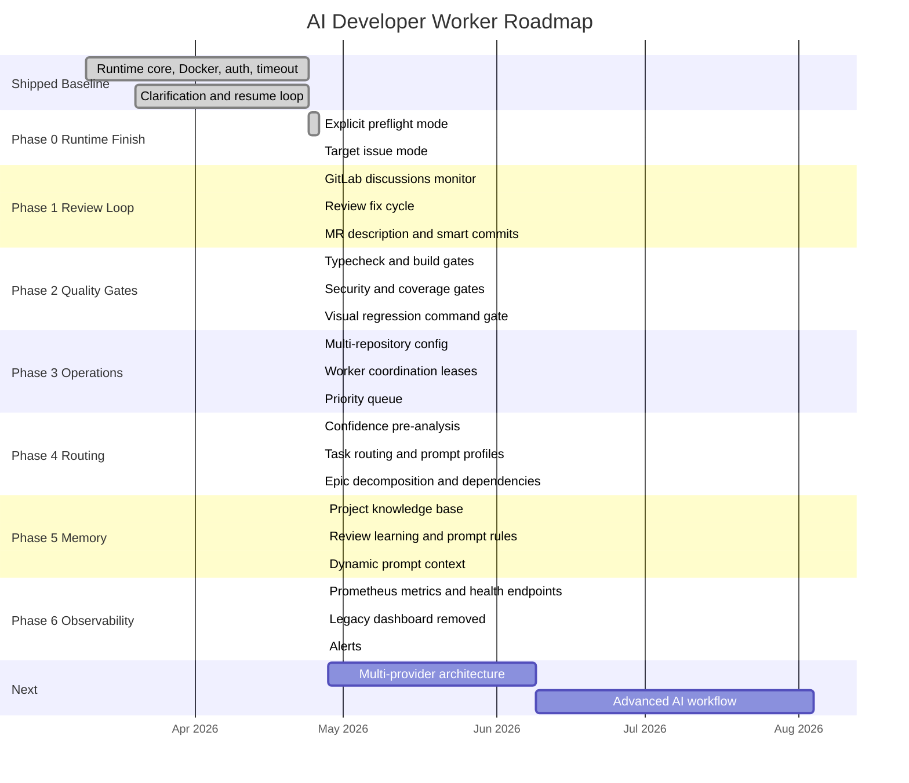

# Product Roadmap - AI Developer Worker

_Актуально на 2026-04-27._

## Видение продукта

**Текущий продукт:** self-hosted Node.js/TypeScript worker/fleet для корпоративного DevOps-цикла. Worker берёт задачи из Yandex Tracker, выбирает repository profile, запускает Codex CLI, валидирует изменения quality gates, создаёт или переиспользует GitLab Merge Request, обрабатывает review feedback, учитывает memory/context и отдаёт observability через metrics/alerts.

**Целевое состояние:** расширяемая платформа AI-разработки: несколько trackers/code review platforms/AI engines, управляемый multi-step engineering pipeline, RAG по кодовой базе, multimodal inputs и production-grade operational control.

## Текущий baseline

### Уже реализовано

- Polling Yandex Tracker по queue/tag, включая single-repo `.env` режим и multi-repository fleet config через YAML/JSON.
- Настраиваемая карта логических статусов через `TRACKER_STATUS_MAP_FILE`: `open`, `in_progress`, `waiting_for_answer`, `review`, `failed`, `done`.
- Восстановление активных задач текущего `WORKER_ID` после рестарта.
- Graceful shutdown для `SIGINT` и `SIGTERM`.
- `WORKER_RUN_ONCE=true` для одного проверочного цикла.
- `npm run preflight` / `WORKER_PREFLIGHT_ONLY=true` для safe preflight без обработки задач.
- `TARGET_ISSUE_KEY` для ручного запуска конкретной Tracker-задачи.
- Startup checks: config, Codex auth, git repository readiness, git fetch, commit identity.
- Codex CLI runner с `codex exec --json`, `threadId`, resume-сессиями, heartbeat-логами, timeout и truncation диагностик.
- Clarification loop через `AI_QUESTION` и явный `/resume`.
- Review feedback loop: unresolved GitLab discussions, фильтрация self-comments, `AI REVIEW` metadata, review-fix prompt, validation, push и replies в MR threads.
- MR description autogen: Summary, Changed Files, Testing, Risks/Notes, Links.
- Smart conventional commit messages с safe fallback.
- Quality gates pipeline: typecheck, lint, tests, build, security scan, SAST, coverage, visual regression command gate.
- Git flow: `feature/ai-task-{issueKey}`, sync base branch, reuse MR, commit, push.
- Git HTTPS auth bootstrap: SSH remote rewrite, `GIT_REPOSITORY_TOKEN`, `GIT_REPOSITORY_USERNAME`, `GIT_REPOSITORY_URL`.
- Worker commits по умолчанию используют `git commit --no-verify`, с опцией `GIT_COMMIT_NO_VERIFY=false`.
- Tracker-comment lease backend: task/repository leases, heartbeat, TTL, stale lease recovery.
- Priority queue scoring: Tracker priority, deadline/SLA, components, tags, manual override, confidence signal.
- Task routing: structured `AI_ANALYSIS`, confidence thresholds, task modes, prompt profiles.
- Epic decomposition: `TASK_MODE=decompose`, dry-run/create modes, sub-issues, dependency links.
- Dependency enforcement: `blockedBy` / `blocks`, link-based blockers and unknown-status policy.
- Project memory: file-backed knowledge base, failure memory, review learning, prompt rules and dynamic prompt context.
- Observability: Prometheus-compatible `/metrics`, `/healthz`, `/readyz`, event store, alerts.
- Docker image on Node 22 with pinned `@openai/codex@0.139.0`, Compose bootstrap writable `CODEX_HOME`.
- Unit and smoke tests across config, Codex auth/runner, Tracker, GitLab, Git, orchestration, quality gates, memory and observability.

### Follow-ups / пока не реализовано полностью

- MR labels, assignees and reviewer routing.
- Несколько независимых логических коммитов в рамках одной задачи.
- Redis/PostgreSQL lock backend implementations; сейчас production-ready contract есть, active backend - Tracker comments.
- Daily digest alerts для managers.
- Daily digest alerts для managers.
- Native visual-regression artifact upload/attachment; сейчас есть command-based gate.
- Diff coverage вместо общего coverage threshold.
- Multi-provider architecture: Jira/GitHub/Bitbucket/Azure DevOps/alternative AI engines.
- Advanced AI workflow: multi-step persisted plan, TDD mode, RAG по коду, multimodal inputs.

## Фаза 0 - Runtime Core

**Статус:** completed.

### 0.1 Graceful shutdown - done

`WorkerOrchestrator.runForever()` и `FleetOrchestrator.runForever()` обрабатывают shutdown signals, будят текущий sleep и завершают цикл без ожидания полного poll interval.

### 0.2 Codex timeout и observability - done

`CODEX_TIMEOUT_SECONDS` ограничивает один `codex exec`; `CODEX_PROGRESS_LOG_INTERVAL_SECONDS` даёт heartbeat; `CODEX_LOG_FULL_EVENTS=true` включает сырые JSONL events для отладки.

### 0.3 Startup preflight - done

Есть safe mode:

- `npm run preflight`;
- `WORKER_PREFLIGHT_ONLY=true`;
- checks для env/status map, Codex auth, git readiness, Tracker/GitLab доступов, target commands;
- отчёт `PASS` / `WARN` / `FAIL`;
- без обработки реальных задач.

### 0.4 Target issue mode - done

`TARGET_ISSUE_KEY=FRONTEND-42`:

- берёт только указанную задачу;
- игнорирует обычный queue scan;
- уважает leases/status;
- работает вместе с `WORKER_RUN_ONCE=true`.

## Фаза 1 - Review Feedback Loop

**Статус:** MVP completed.

### 1.1 GitLab discussions monitor - done

`GitLabService` умеет получать unresolved MR discussions, отличать reviewer comments от worker comments и группировать замечания по файлам/line ranges/topics.

### 1.2 Review fix cycle - done

Реализован цикл:

```text
review -> in_progress -> review -> ... -> failed/manual_hold
```

Worker строит review-fix prompt с diff context, запускает Codex, прогоняет validation, пушит новый commit и отвечает в MR thread. `AI REVIEW` metadata защищает от повторной обработки одних и тех же discussions.

### 1.3 MR description autogen - done

MR создаётся с description:

- Summary;
- Changed Files;
- Testing;
- Risks / Notes;
- Links.

### 1.4 Smart commit messages - done

Commit helper формирует conventional commit subject с issue key и fallback на `feat: implement ISSUE-KEY`.

## Фаза 2 - Quality Gates и публикация

**Статус:** completed.

### 2.1 Type check как отдельный gate - done

```env
TYPE_CHECK_COMMAND=npm run typecheck
```

Gate optional и работает fail-fast перед lint/tests.

### 2.2 Build verification - done

```env
BUILD_COMMAND=npm run build
```

Build gate optional и блокирует publish при failure.

### 2.3 Security scan - done

Command-based interface:

```env
SECURITY_SCAN_COMMAND=npm audit --audit-level=high
SAST_COMMAND=semgrep ci
```

Без жёсткой привязки к конкретному scanner.

### 2.4 Coverage gate - done

```env
COVERAGE_COMMAND=npm run test:coverage -- --reporter=json
MIN_COVERAGE_PERCENT=80
COVERAGE_REPORT_FILE=coverage/coverage-summary.json
```

MVP проверяет общий coverage percent.

### 2.5 Visual regression - MVP done

```env
VISUAL_REGRESSION_COMMAND=npm run test:visual
VISUAL_REGRESSION_ARTIFACTS_DIR=playwright-report
```

Сейчас это command-based gate. Native screenshot diff orchestration and artifact publishing остаются follow-up.

## Фаза 3 - Operational Control и масштабирование

**Статус:** MVP completed.

### 3.1 Multi-repository config - done

Поддерживается `WORKER_CONFIG_FILE` с YAML/JSON:

```yaml
repositories:
  - name: client-application
    repoPath: /workspace/client-app
    gitlabProjectId: "42"
    baseBranch: main
    queues: ["FRONTEND"]
    tags: ["ai_dev"]
    testCommand: "npm test"
    lintCommand: "npm run lint"
    typeCheckCommand: "npm run typecheck"

  - name: backend-api
    repoPath: /workspace/backend
    gitlabProjectId: "43"
    baseBranch: develop
    queues: ["BACKEND"]
    tags: ["ai_dev"]
    testCommand: "go test ./..."
    lintCommand: "golangci-lint run"
```

Single-repo `.env` режим сохранён как compatibility path.

### 3.2 Stronger worker coordination - MVP done

Реализовано:

- `AI LEASE` structured comments;
- task lease и repository lease;
- TTL и heartbeat;
- stale lease recovery;
- защита от одновременной работы разных workers в одном `repoPath`.

Redis/PostgreSQL backends остаются production follow-up.

### 3.3 Priority queue - done

Selection использует scoring:

- Tracker priority;
- deadline/SLA;
- components/tags;
- confidence score;
- manual override;
- deterministic tie-breaks.

## Фаза 4 - Task Routing и декомпозиция

**Статус:** MVP completed.

### 4.1 Confidence pre-analysis - done

Analysis stage возвращает `AI_ANALYSIS`:

- confidence `0..100`;
- expected files/subsystems;
- risk factors;
- missing context;
- recommended mode: `implement`, `ask_clarification`, `decompose`, `human`.

### 4.2 Task routing - done

Prompt profiles:

- `frontend_ui_fix`;
- `backend_endpoint`;
- `tests_only`;
- `refactor`;
- `dependency_update`;
- `documentation`;
- `general`.

Profiles влияют на implementation/fix/review-fix prompts.

### 4.3 Epic decomposition - MVP done

```env
TASK_MODE=decompose
DECOMPOSITION_CREATE_ISSUES=true
DECOMPOSITION_DRY_RUN=false
```

Worker строит `AI_DECOMPOSITION`, валидирует план, создаёт sub-issues и dependency links. Dry-run режим поддержан для безопасного тестирования.

### 4.4 Dependencies between tasks - done

`TrackerIssue` расширен:

```typescript
interface TrackerIssue {
  blockedBy?: string[];
  blocks?: string[];
}
```

Worker не берёт задачу, пока blockers не закрыты. Unknown status policy configurable.

## Фаза 5 - Context и Memory

**Статус:** MVP completed.

### 5.1 Project knowledge base - done

File-backed memory store:

```text
MEMORY_DIR/
  repositories/
    <repository-key>/
      knowledge.json
      prompt-rules.json
      failures.jsonl
      review-learning.jsonl
      metadata.json
```

Knowledge base содержит:

- architecture map;
- entry points;
- code patterns;
- test strategy;
- known pitfalls;
- project-specific conventions.

### 5.2 Learning from review - MVP done

После review/merge worker может сохранять:

- review learning entries;
- validation failure memory;
- prompt rules with approval state;
- source refs and confidence.

Draft-first workflow защищает от автоматического закрепления одноразовых замечаний.

### 5.3 Dynamic system prompt - done

Prompt context собирается из:

- repository instructions (`AGENTS.md`, `CONTRIBUTING.md`, `.editorconfig`);
- task type and prompt profile;
- repo profile;
- knowledge base;
- approved prompt rules;
- similar failures.

Context ограничен budget и отключается через `MEMORY_ENABLED=false`.

## Фаза 6 - Наблюдаемость

**Статус:** MVP completed.

### 6.1 Prometheus metrics first - done

Worker отдаёт `/metrics` с key metrics:

```text
ai_developer_tasks_total{status,repository}
ai_developer_task_duration_seconds
ai_developer_codex_duration_seconds
ai_developer_fix_attempts_total
ai_developer_mr_created_total
ai_developer_queue_depth
ai_developer_clarifications_total
ai_developer_worker_state
ai_developer_alerts_total
```

Также есть `/healthz` и `/readyz`.

### 6.2 Legacy web dashboard - removed

Legacy read-only dashboard и `DASHBOARD_*` конфигурация удалены. Human workflow
и operations views обслуживает Angular task tracker console на `/tasks`, а
машинная наблюдаемость остаётся в `/metrics`, `/healthz`, `/readyz` и alerts.

### 6.3 Alerts - MVP done

Поддержаны notification sinks:

- Slack webhook;
- Telegram bot;
- generic webhook.

Rules:

- `task_failed`;
- `queue_blocked`;
- `mr_ready`;
- `codex_timeouts_repeated`;
- `validation_failures_repeated`.

Есть severity filtering and dedup window.

## Фаза 7 - Multi-provider architecture

**Статус:** next.
**Срок:** 5-6 недель.
**Цель:** снизить vendor lock-in и расширить применимость за пределы Yandex Tracker + GitLab + Codex CLI.

### 7.1 Task tracker abstraction

`TrackerClient` уже отделён интерфейсом. Следующий шаг - provider-neutral contract and adapters:

- Jira Cloud / Server;
- Linear;
- GitHub Issues;
- YouTrack.

Key work:

- normalized issue model;
- status mapping per provider;
- comment/thread abstraction;
- link/dependency abstraction;
- provider-specific preflight.

### 7.2 Code review platform abstraction

Текущий `GitLabService` нужно обобщить до `CodeReviewPlatform`:

- GitHub Pull Requests;
- Bitbucket Pull Requests;
- Azure DevOps Pull Requests.

Key work:

- MR/PR model;
- review discussions/comments model;
- branch and diff APIs;
- replies and metadata persistence;
- provider-specific links in Tracker comments.

### 7.3 AI engine abstraction

Текущий `CodexRunner` нужно обобщить до `AICodeEngine`:

- Codex CLI;
- Claude Code;
- Aider;
- OpenHands;
- OpenAI-compatible custom engine.

Key work:

- common execution result contract;
- thread/session/resume capabilities;
- structured question/analysis/decomposition protocol;
- timeout and event handling;
- engine-specific auth preflight.

## Фаза 8 - Advanced AI Workflow

**Статус:** later.
**Срок:** 6-8 недель.
**Цель:** перейти от одного AI-запуска к управляемому engineering pipeline.

### 8.1 Multi-step planning

Pipeline:

```text
analyze -> plan -> implement-step -> validate -> fix -> finalize
```

Оркестратор должен хранить план, шаги, статусы и retries каждого шага.

### 8.2 Self-testing / TDD mode

Для подходящих задач:

1. Сначала генерировать тесты.
2. Проверять, что они падают без реализации.
3. Реализовывать feature.
4. Добиваться прохождения tests/gates.

### 8.3 RAG по кодовой базе

Индексирование репозитория:

- embeddings для файлов и символов;
- retrieval релевантных файлов на analysis stage;
- обновление индекса после merge.

### 8.4 Multimodal inputs

Поддержать задачи с:

- screenshots;
- Figma links;
- OpenAPI/Swagger specs;
- architecture diagrams.

## Визуальный roadmap



## Метрики успеха

| Направление | Текущее состояние | Следующая цель |
| --- | --- | --- |
| Controlled startup | Startup checks + explicit preflight report | Provider-specific preflight for Phase 7 adapters |
| Manual debugging | `TARGET_ISSUE_KEY` + `WORKER_RUN_ONCE=true` | Debug modes per provider/engine |
| Clarification loop | `AI_QUESTION` + `/resume` | SLA alerts for long waiting states |
| Review loop | GitLab unresolved discussions auto-fix MVP | Provider-neutral review loop |
| Quality gates | Command-based ordered gates | Diff coverage and native visual artifacts |
| MR quality | Generated description and smart commit message | Labels, assignees, reviewers |
| Worker coordination | Tracker-comment leases with TTL | Redis/PostgreSQL lock backend |
| Supported repos | Multi-repo fleet profiles | Multi-provider routing |
| Task routing | Confidence, prompt profiles, decomposition, dependencies | Persisted multi-step plans |
| Context | File-backed memory and prompt rules | RAG over codebase |
| Observability | Metrics, events, alerts | Daily digest and richer Angular operations views |

## Рекомендуемый фокус на ближайшие 90 дней

1. Закрыть production follow-ups Phase 1-6: MR labels/assignees, daily digest, Redis/PostgreSQL locks.
2. Начать Phase 7 с provider contracts до новых integrations: `TaskTracker`, `CodeReviewPlatform`, `AICodeEngine`.
3. Добавить GitHub PR/GitHub Issues как первый non-GitLab/non-Tracker path, если нужен market expansion.
4. Подготовить Phase 8 foundation: persisted plan model and step state machine.
5. Спланировать RAG отдельно от file-backed memory: embeddings, index lifecycle, privacy and storage policy.

## Стратегические развилки

### Self-hosted или SaaS

Для текущей аудитории с Yandex Tracker и GitLab self-hosted остаётся базовым вариантом: код, токены, memory и Codex auth остаются внутри инфраструктуры пользователя. SaaS имеет смысл рассматривать после Phase 7 provider abstractions и отдельной security/multi-tenant модели.

### Специализация или универсальность

Task routing и prompt profiles уже дали контролируемую специализацию. Следующий шаг - provider-neutral contracts без потери repository-specific behavior.

### AI engine lock-in

Codex CLI остаётся основным engine благодаря resume, JSONL events и local repo workflow. До подключения других engines нужно зафиксировать neutral `AICodeEngine` contract, чтобы не переносить Codex-specific assumptions в Phase 8 pipeline.
