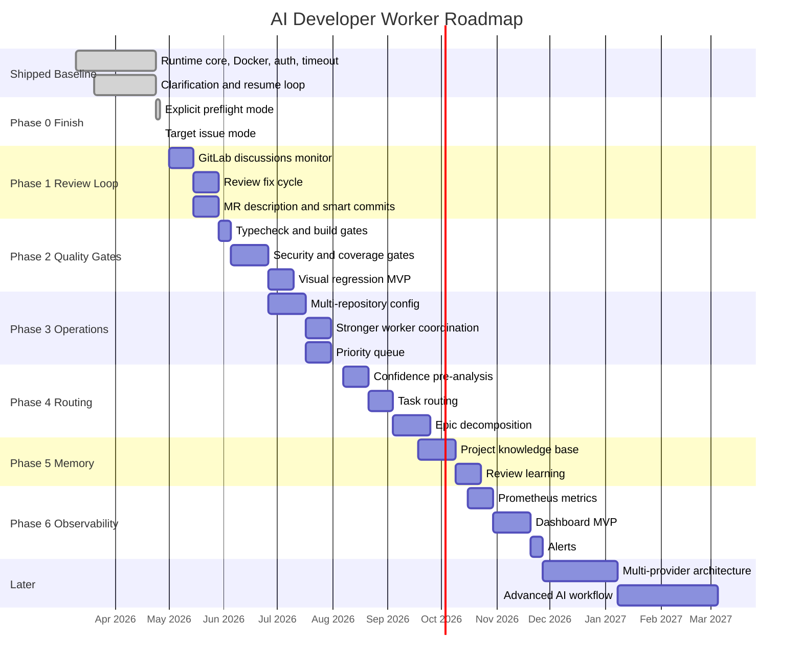

# Product Roadmap - AI Developer Worker

_Актуально на 2026-04-26._

## Видение продукта

**Текущий продукт:** однопроцессный Node.js/TypeScript воркер, который берёт задачи из Yandex Tracker, запускает Codex CLI в целевом git-репозитории, валидирует изменения тестами и линтером, пушит ветку и создаёт или переиспользует GitLab Merge Request.

**Целевое состояние:** self-hosted платформа AI-разработки для корпоративного DevOps-цикла: от выбора и уточнения задачи до review-итераций, quality gates, наблюдаемости, поддержки нескольких репозиториев и обучения на обратной связи.

## Текущий baseline

### Уже реализовано

- Polling Yandex Tracker по `TRACKER_DEFAULT_QUEUE` и `TRACKER_TAG`.
- Настраиваемая карта логических статусов через `TRACKER_STATUS_MAP_FILE`: `open`, `in_progress`, `waiting_for_answer`, `review`, `failed`, `done`.
- Восстановление активной задачи текущего `WORKER_ID` после рестарта.
- Лёгкая координация нескольких воркеров через структурированные Tracker-комментарии `AI STATUS`.
- Graceful shutdown для `SIGINT` и `SIGTERM`: воркер завершает текущий цикл и не ждёт полный poll interval.
- `WORKER_RUN_ONCE=true` для одного проверочного цикла.
- `npm run preflight` / `WORKER_PREFLIGHT_ONLY=true` для safe preflight отчёта без обработки задач.
- `TARGET_ISSUE_KEY` для ручного запуска конкретной Tracker-задачи без обычного queue scan.
- Startup checks: загрузка конфига, проверка Codex auth, готовность git-репозитория, git fetch, наличие commit identity.
- Codex CLI runner с `codex exec --json`, `threadId`, resume-сессиями, heartbeat-логами, truncation шумных диагностик и опциональным `CODEX_LOG_FULL_EVENTS`.
- Hard timeout для одного Codex запуска через `CODEX_TIMEOUT_SECONDS`.
- Clarification loop: Codex может вернуть структурированный `AI_QUESTION: {...}`, воркер переводит задачу в `waiting_for_answer`, ждёт явный `/resume`, затем продолжает прежнюю Codex thread.
- Автоисправления после проваленных `TEST_COMMAND` или `LINT_COMMAND` до `MAX_FIX_ATTEMPTS`.
- Review feedback loop MVP: unresolved GitLab discussions, фильтрация self-comments, `AI REVIEW` processed metadata, Codex review-fix prompt, validation, push и replies в MR threads.
- Автогенерация MR description с Summary, Changed Files, Testing, Risks/Notes и Links.
- Smart conventional commit messages с fallback на `feat: implement ISSUE-KEY`.
- Git flow: `feature/ai-task-{issueKey}`, sync base branch, reuse существующего MR, commit, push.
- Git HTTPS auth bootstrap: rewrite SSH remote в HTTPS при необходимости, `GIT_REPOSITORY_TOKEN`, `GIT_REPOSITORY_USERNAME`, `GIT_REPOSITORY_URL`.
- Worker commits по умолчанию используют `git commit --no-verify`, с возможностью включить repo hooks через `GIT_COMMIT_NO_VERIFY=false`.
- Docker image на Node 22 с pinned `@openai/codex@0.124.0`, Compose bootstrap writable `CODEX_HOME` из host auth.
- Unit tests и smoke test для config, Codex auth/runner, Tracker client, Git service, orchestrator, retry, shell timeout и end-to-end mock Tracker/GitLab flow.

### Пока не реализовано

- MR labels, assignees и reviewer routing.
- Несколько независимых логических коммитов.
- Отдельные quality gates для typecheck, build, coverage, security и visual regression.
- Multi-repository config и полноценная priority queue.
- Dashboard, Prometheus metrics, alerts.
- Абстракции для Jira/GitHub/Bitbucket/других AI engines.

## Фаза 0 - Runtime Core

**Статус:** completed.

### 0.1 Graceful shutdown - done

`WorkerOrchestrator.runForever()` обрабатывает `SIGINT` и `SIGTERM`, будит текущий sleep и завершает цикл без зависания на poll interval.

### 0.2 Codex timeout и observability - done

`CODEX_TIMEOUT_SECONDS` ограничивает один `codex exec`; `CODEX_PROGRESS_LOG_INTERVAL_SECONDS` даёт heartbeat; `CODEX_LOG_FULL_EVENTS=true` включает сырые JSONL events для отладки.

### 0.3 Startup preflight - done

На старте и в явном preflight-режиме проверяются:

- обязательные env vars и status map;
- Codex auth через `codex login status` или `CODEX_API_KEY`;
- git remote/fetch;
- commit identity для worker commits.
- Tracker API read/write permissions без смены статусов реальных задач;
- GitLab MR API permissions;
- `TEST_COMMAND` и `LINT_COMMAND` в target repo;
- единый отчёт `PASS` / `WARN` / `FAIL`.

### 0.4 Target issue mode - done

`TARGET_ISSUE_KEY=FRONTEND-42` поддерживает отладку и ручные прогоны:

- брать только указанную задачу;
- игнорировать обычный queue scan;
- уважать worker lock и статус задачи;
- работать вместе с `WORKER_RUN_ONCE=true`.

## Фаза 1 - Review Feedback Loop

**Статус:** MVP-completed.
**Срок:** 3-4 недели.
**Цель:** закрыть самый дорогой ручной этап после создания MR.

Worker доводит задачу до MR, переводит Tracker в `review`, затем может подхватить unresolved review discussions и выполнить fix cycle.

### 1.1 GitLab discussions monitor - MVP done

Расширить `GitLabService`:

- получать unresolved MR discussions;
- отличать reviewer comments от комментариев самого воркера;
- группировать замечания по файлам, line ranges и темам;
- сохранять последний обработанный discussion/comment id, чтобы не повторять одну и ту же работу.

### 1.2 Review fix cycle - MVP done

Добавить цикл:

```text
review -> in_progress -> review -> ... -> failed/manual_hold
```

Варианты реализации:

- добавить логический статус `fixing_review` в status map;
- или переиспользовать `in_progress` с `waitingReason/manual context` в structured comments.

Критерии готовности:

- воркер видит unresolved review comments;
- строит prompt с diff context и списком замечаний;
- запускает Codex resume или fresh fix session;
- прогоняет validation;
- пушит новый commit;
- отвечает в MR thread;
- не зацикливается бесконечно, если review fix не проходит.

### 1.3 MR description autogen - MVP done

Заменить минимальный MR title `[AI] FRONTEND-123 implementation` на содержательный MR payload:

- Summary: что изменено и зачем;
- Changed files: сгруппированный список с краткими аннотациями;
- Testing: `TEST_COMMAND`, `LINT_COMMAND`, будущие gates;
- Risks/Notes: ограничения и ручные действия;
- Links: Tracker issue, branch, worker id.

### 1.4 Smart commit messages - MVP done

Текущий commit message: `feat: implement ISSUE-KEY`.

Цель:

- conventional commit по области изменений;
- issue key в конце сообщения;
- несколько коммитов только если изменения реально независимы;
- fallback на текущий шаблон, если Codex не дал безопасного summary.

## Фаза 2 - Quality Gates и публикация

**Срок:** 3-4 недели.
**Цель:** сделать MR ближе к production-ready до появления ревьюера.

### 2.1 Type check как отдельный gate

Добавить:

```env
TYPE_CHECK_COMMAND=npm run typecheck
```

Порядок fail-fast:

```text
typecheck -> lint -> tests
```

Если переменная не задана, gate пропускается.

### 2.2 Build verification

Добавить:

```env
BUILD_COMMAND=npm run build
```

Build должен запускаться после tests/lint или как отдельная publish-проверка перед push.

### 2.3 Security scan

Опциональные команды:

```env
SECURITY_SCAN_COMMAND=npm audit --audit-level=high
SAST_COMMAND=semgrep ci
```

Первый шаг - command-based interface без жёсткой привязки к конкретному сканеру.

### 2.4 Coverage gate

Добавить:

```env
COVERAGE_COMMAND=npm run test:coverage -- --reporter=json
MIN_COVERAGE_PERCENT=80
```

Первый MVP может проверять только общий процент. Позже - diff coverage.

### 2.5 Visual regression

Для frontend-репозиториев:

- headless browser screenshots;
- before/after comparison;
- прикрепление скриншотов или ссылок к MR.

Эта фича зависит от multi-repo/project profile settings, поэтому её стоит делать после command-based gates.

## Фаза 3 - Operational Control и масштабирование

**Срок:** 4-6 недель.
**Цель:** перейти от одного supervised worker к управляемому fleet.

### 3.1 Multi-repository config

Перейти от плоского `.env` к YAML/JSON конфигу:

```yaml
repositories:
  - name: client-application
    repoPath: /workspace/client-app
    gitlabProjectId: "42"
    baseBranch: main
    queues: ["FRONTEND"]
    testCommand: "npm test"
    lintCommand: "npm run lint"
    typeCheckCommand: "npm run typecheck"

  - name: backend-api
    repoPath: /workspace/backend
    gitlabProjectId: "43"
    baseBranch: develop
    queues: ["BACKEND"]
    testCommand: "go test ./..."
    lintCommand: "golangci-lint run"
```

### 3.2 Stronger worker coordination

Текущий lock через Tracker comments достаточен для MVP, но не для высокой параллельности.

Направления:

- lease/heartbeat с TTL;
- Redis/PostgreSQL lock backend для production;
- автоматический возврат задач в пул, если worker пропал;
- запрет одновременной работы разных воркеров в одном repo path.

### 3.3 Priority queue

Заменить простое "старейшая открытая задача" на scoring:

- Tracker priority;
- deadline/SLA;
- компоненты и tags;
- confidence score;
- manual override.

## Фаза 4 - Task Routing и декомпозиция

**Срок:** 4-5 недель.
**Цель:** повысить success rate за счёт выбора подходящих задач и правильной декомпозиции.

### 4.1 Confidence pre-analysis

Перед implementation воркер уже делает analysis stage. Следующий шаг - вернуть структурированную оценку:

- confidence 0-100;
- expected files and subsystems;
- risk factors;
- missing context;
- recommended mode: implement, ask clarification, decompose, human.

Если confidence ниже порога, задача переводится в `waiting_for_answer` или специальный human status.

### 4.2 Task routing

Специализированные prompt profiles:

- frontend UI fix;
- backend endpoint;
- tests-only;
- refactor;
- dependency update;
- documentation.

Это дешевле и полезнее, чем сразу пытаться поддержать "любой тип задачи" одинаковым prompt.

### 4.3 Epic decomposition

Режим:

```env
TASK_MODE=decompose
```

Воркер анализирует крупную задачу и создаёт sub-issues в Tracker:

```text
FRONTEND-100 Notifications
  -> FRONTEND-101 Data model
  -> FRONTEND-102 API integration
  -> FRONTEND-103 Realtime channel
  -> FRONTEND-104 NotificationBell UI
```

### 4.4 Dependencies between tasks

Расширить `TrackerIssue`:

```typescript
interface TrackerIssue {
  blockedBy?: string[];
  blocks?: string[];
}
```

Воркер не берёт задачу, пока её dependencies не закрыты.

## Фаза 5 - Context и Memory

**Срок:** 3-4 недели.
**Цель:** перестать начинать каждую задачу "с нуля".

### 5.1 Project knowledge base

Структурированная база знаний по репозиторию:

- architecture map;
- entry points;
- code patterns;
- test strategy;
- known pitfalls;
- project-specific conventions.

### 5.2 Learning from review

После merge:

- сравнить worker branch и финальный merge diff;
- извлечь повторяющиеся reviewer preferences;
- обновить prompt rules для этого репозитория.

### 5.3 Dynamic system prompt

Prompt должен собираться из:

- `AGENTS.md` / `CONTRIBUTING.md` / `.editorconfig`;
- task type;
- repo profile;
- knowledge base;
- прошлых failures в похожих задачах.

## Фаза 6 - Dashboard и наблюдаемость

**Срок:** 4-5 недель.
**Цель:** дать оператору картину состояния без чтения stdout логов.

### 6.1 Prometheus metrics first

Начать с метрик, потому что они дешевле dashboard:

```text
ai_developer_tasks_total{status}
ai_developer_task_duration_seconds
ai_developer_codex_duration_seconds
ai_developer_fix_attempts_total
ai_developer_mr_created_total
ai_developer_queue_depth
ai_developer_clarifications_total
```

### 6.2 Web dashboard MVP

Минимальные представления:

- workers: idle, processing, waiting, error;
- current task per worker;
- recent tasks: Tracker issue -> branch -> MR -> status;
- failure diagnostics;
- average duration and success rate.

### 6.3 Alerts

Каналы:

- Slack/Telegram for failed task, auth failure, queue blocked, MR ready;
- daily digest для managers;
- alert на repeated Codex timeouts или validation failures.

## Фаза 7 - Multi-provider architecture

**Срок:** 5-6 недель.
**Цель:** снизить vendor lock-in и расширить рынок.

### 7.1 Task tracker abstraction

`TrackerClient` уже отделён интерфейсом. Добавить реализации:

- Jira Cloud / Server;
- Linear;
- GitHub Issues;
- YouTrack.

### 7.2 Code review platform abstraction

Текущий `GitLabService` нужно обобщить до `CodeReviewPlatform`:

- GitHub Pull Requests;
- Bitbucket Pull Requests;
- Azure DevOps Pull Requests.

### 7.3 AI engine abstraction

Текущий `CodexRunner` нужно обобщить до `AICodeEngine`:

- Codex CLI;
- Claude Code;
- Aider;
- OpenHands;
- OpenAI-compatible custom engine.

## Фаза 8 - Advanced AI Workflow

**Срок:** 6-8 недель.
**Цель:** перейти от одного AI-запуска к управляемому engineering pipeline.

### 8.1 Multi-step planning

Pipeline:

```text
analyze -> plan -> implement-step -> validate -> fix -> finalize
```

Оркестратор хранит план и статус каждого шага, а не просто ждёт финального Codex результата.

### 8.2 Self-testing / TDD mode

Для подходящих задач:

1. Сначала генерировать тесты.
2. Проверять, что они падают без реализации.
3. Реализовывать feature.
4. Добиваться прохождения tests/gates.

### 8.3 RAG по кодовой базе

Индексирование репозитория:

- embeddings для файлов и символов;
- retrieval релевантных файлов на этапе analysis;
- обновление индекса после merge.

### 8.4 Multimodal inputs

Поддержать задачи с:

- screenshots;
- Figma links;
- OpenAPI/Swagger specs;
- architecture diagrams.

## Визуальный roadmap



## Метрики успеха

| Направление | Текущее состояние | Цель ближайшего этапа |
| --- | --- | --- |
| Controlled startup | Есть config/auth/git checks и отдельный preflight report без мутации задач | Расширять checks по мере добавления gates |
| Manual debugging | `TARGET_ISSUE_KEY` + `WORKER_RUN_ONCE=true` | Использовать режим для review loop и quality gates debugging |
| Clarification loop | Работает через `AI_QUESTION` и `/resume` | Добавить SLA/alert на долгие ожидания ответа |
| Review loop | MR создан, дальше ручная работа | Автообработка unresolved GitLab discussions |
| Quality gates | changed check + tests + lint | typecheck + build + optional security/coverage |
| MR quality | Минимальный title, без description | Summary, testing, risks, links, labels |
| Worker coordination | Structured comments lock | Lease/TTL и защита от stale locks |
| Supported repos | Один target repo на worker config | Multi-repo config и routing |
| Observability | JSON logs | Metrics, dashboard, alerts |

## Рекомендуемый фокус на ближайшие 90 дней

1. Реализовать GitLab review loop, потому что он напрямую сокращает ручную работу после MR.
2. Поднять качество MR: generated description, testing summary, smart commits.
3. Добавить command-based quality gates: typecheck и build первыми, security/coverage следующими.
4. Начать observability с Prometheus metrics до полноценного dashboard.

## Стратегические развилки

### Self-hosted или SaaS

Для текущей аудитории с Yandex Tracker и GitLab self-hosted остаётся базовым вариантом: код, токены и Codex auth остаются внутри инфраструктуры пользователя. SaaS имеет смысл рассматривать только после GitHub/Jira integrations и отдельной security модели.

### Специализация или универсальность

Лучший ближайший путь - task routing. Вместо одного универсального prompt для всех задач нужно выделить profiles по типам работ. Это повышает success rate без отказа от общего coverage очереди.

### AI engine lock-in

Codex CLI сейчас является правильным первым engine, потому что уже интегрирован с resume, JSONL events и local repo workflow. Но интерфейс `CodexRunner` стоит расширять до engine-neutral контракта до того, как появятся сложные provider-specific assumptions.
