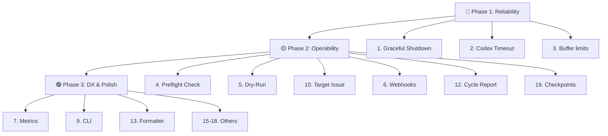

# Анализ проекта AI Developer Worker

## Краткое описание

Проект — это Node.js/TypeScript воркер, который:
1. Поллит очередь Yandex Tracker по тегу
2. Запускает `codex-cli` для реализации задачи в целевом репозитории
3. Валидирует результат (тесты + линтер)
4. Создаёт Merge Request в GitLab
5. Обновляет статус и комментарии в Tracker

Архитектура чистая — есть разделение на `domain/`, `integrations/`, `utils/`, `models/`. Тестовое покрытие хорошее (unit + smoke). Docker-сценарий полностью рабочий.

---

## 🔴 Критичные улучшения

### 1. Graceful Shutdown (SIGTERM/SIGINT)

**Проблема:** Метод [runForever()](file:///c:/Users/gabba/projects/developer/src/domain/orchestrator.ts#85-103) — бесконечный цикл `while(true)` без обработки сигналов остановки. При `docker stop` или `Ctrl+C` процесс прерывается посреди цикла, что может оставить задачу в Tracker в неконсистентном состоянии.

**Решение:**
```typescript
// src/domain/orchestrator.ts
private shuttingDown = false;

async runForever(): Promise<void> {
  const shutdown = () => {
    this.logger.info("Shutdown signal received, finishing current cycle.");
    this.shuttingDown = true;
  };
  process.on("SIGINT", shutdown);
  process.on("SIGTERM", shutdown);

  while (!this.shuttingDown) {
    try {
      const outcome = await this.runOnce();
      if (outcome !== "processed" && !this.shuttingDown) {
        await this.interruptibleSleep(this.config.pollIntervalMs);
      }
    } catch (error) {
      this.logger.error("Worker cycle failed.", { ... });
      if (!this.shuttingDown) {
        await this.interruptibleSleep(this.config.pollIntervalMs);
      }
    }
  }
  this.logger.info("Worker shut down gracefully.");
}
```

### 2. Таймаут для Codex CLI

**Проблема:** Запуск `codex exec` в [runner.ts](file:///c:/Users/gabba/projects/developer/src/integrations/codex/runner.ts#L243-L331) не ограничен по времени. Если Codex зависнет — воркер завис навсегда.

**Решение:** Добавить `CODEX_TIMEOUT_SECONDS` в конфигурацию и использовать `AbortController` + `signal` в `spawn`, либо явно убивать процесс по таймауту:
```typescript
// В конфиге:
codexTimeoutMs: parsePositiveInt(env.CODEX_TIMEOUT_SECONDS ?? "1800", "CODEX_TIMEOUT_SECONDS") * 1000,

// В runner.ts:
const timeout = setTimeout(() => {
  child.kill("SIGTERM");
}, config.codexTimeoutMs);
```

### 3. Ограничение размера stdout/stderr буферов

**Проблема:** В [shell.ts](file:///c:/Users/gabba/projects/developer/src/utils/shell.ts) stdout и stderr копятся целиком в память (`stdout += text`). Для длительных тестовых прогонов или объёмного вывода Codex это может привести к OOM.

**Решение:** Ввести кольцевой буфер или ограничение на размер хранимого вывода:
```typescript
const MAX_BUFFER = 512 * 1024; // 512 KB
// При сохранении:
if (stdout.length + text.length > MAX_BUFFER) {
  stdout = stdout.slice(-MAX_BUFFER / 2) + text;
}
```

---

## 🟡 Существенные улучшения

### 4. Валидация конфигурации при старте (Preflight Check)

**Текущее состояние:** Конфигурация загружается и проверяется формально (наличие переменных), но нет проверки реальной доступности сервисов.

**Рекомендация:** Добавить команду `npm run preflight` или флаг `--preflight`:
- Проверить подключение к Tracker API (GET `/myself`)
- Проверить подключение к GitLab API (GET `/projects/:id`)
- Проверить наличие и permissions git remote
- Проверить, что `testCommand` и `lintCommand` вообще запускаются в целевом репозитории
- Проверить, что trackerStatusMap корректно резолвит все логические статусы для текущей очереди

### 5. Dry-Run режим

**Проблема:** Нет возможности запустить воркер «вхолостую», чтобы проверить, что он правильно находит задачи, строит промпт, и т.д. — без реальных побочных эффектов.

**Решение:** Добавить `WORKER_DRY_RUN=true`:
- Находит задачу, логирует промпт
- Не запускает Codex, не меняет статусы, не пушит
- Позволяет быстро отладить маппинг статусов и фильтрацию задач

### 6. Уведомления об ошибках (Webhook / Alerts)

**Проблема:** При фатальной ошибке воркер пишет в лог и переходит к следующему циклу. Оператор может долго не замечать проблему.

**Решение:** Добавить опциональный webhook-нотификатор:
```
ALERT_WEBHOOK_URL=https://hooks.slack.com/services/...
```
Отправка POST при: 
- смене задачи в `failed`
- [ConfigurationError](file:///c:/Users/gabba/projects/developer/src/utils/errors.ts#13-19)
- N неудачных циклов подряд

### 7. Метрики и наблюдаемость

**Текущее состояние:** Логгер — минималистичный JSON в stdout. Это хорошо для Docker, но недостаточно для мониторинга.

**Рекомендации:**
- Добавить счётчики: `tasks_processed_total`, `tasks_failed_total`, `codex_runs_total`, `codex_duration_seconds`
- Экспортировать через Prometheus endpoint (`/metrics`) или в лог как periodic summary
- Добавить `requestId` / `correlationId` для трейсинга цепочки действий по одной задаче

### 8. Ротация лог-уровня в рантайме

**Проблема:** Нет возможности временно включить `debug`-логирование без перезапуска.

**Решение:** Добавить `LOG_LEVEL` и поддержку `debug` уровня, а также обработку `SIGUSR1` для переключения уровня на лету.

---

## 🟢 Улучшения для удобства пользования (DX)

### 9. CLI-интерфейс вместо чистых env-переменных

**Проблема:** Все 30+ параметров задаются через [.env](file:///c:/Users/gabba/projects/developer/.env). Это хорошо для Docker, но неудобно для локальной разработки и отладки.

**Решение:** Добавить минимальный CLI парсер (например, `node:util.parseArgs`):
```bash
npx tsx src/index.ts --run-once --dry-run --issue FRONTEND-123
npx tsx src/index.ts --preflight
npx tsx src/index.ts --validate-config
```
Env-переменные остаются основным способом конфигурации, CLI — для overrides.

### 10. Команда для обработки конкретного тикета

**Проблема:** Воркер забирает самый старый подходящий тикет. Нет возможности явно указать конкретный тикет.

**Решение:** Добавить `TARGET_ISSUE_KEY=FRONTEND-42`:
```typescript
if (config.targetIssueKey) {
  const issue = await tracker.getIssue(config.targetIssueKey);
  return this.handleIssue(issue, await tracker.getComments(issue.key));
}
```
Удобно для отладки и ручного запуска.

### 11. Улучшение Docker Compose с health check

**Текущее состояние:** [compose.yaml](file:///c:/Users/gabba/projects/developer/compose.yaml) — минимальный, без health check.

**Решение:**
```yaml
services:
  worker:
    # ... existing config ...
    healthcheck:
      test: ["CMD", "node", "-e", "process.exit(0)"]
      interval: 30s
      timeout: 5s
      retries: 3
    restart: unless-stopped
    logging:
      driver: json-file
      options:
        max-size: "10m"
        max-file: "5"
```

### 12. Отчёт о результатах цикла

**Проблема:** После [runOnce](file:///c:/Users/gabba/projects/developer/src/domain/orchestrator.ts#104-118) в лог пишется только `"Worker completed a single run."`. Нет summary — какой тикет обработан, какой был результат, сколько fix-попыток, ссылка на MR.

**Решение:** Вернуть из [runOnce()](file:///c:/Users/gabba/projects/developer/src/domain/orchestrator.ts#104-118) расширенный `CycleResult`:
```typescript
interface CycleResult {
  outcome: "processed" | "idle" | "waiting";
  issueKey?: string;
  mergeRequestUrl?: string;
  fixAttempts?: number;
  duration?: number;
  error?: string;
}
```
И логировать в [index.ts](file:///c:/Users/gabba/projects/developer/src/index.ts):
```typescript
const result = await orchestrator.runOnce();
logger.info("Cycle complete.", result);
```

### 13. Formatter & Linter для самого проекта

**Текущее состояние:** В [AGENTS.md](file:///c:/Users/gabba/projects/developer/AGENTS.md) отмечено "There is no formatter configured yet".

**Рекомендация:** Добавить:
- **Biome** или **ESLint 9 flat config** + **Prettier** — для консистентного стиля
- `npm run lint:fix` — для автоматического исправления
- Pre-commit hook через `husky` + `lint-staged`

```json
{
  "scripts": {
    "lint": "biome check .",
    "lint:fix": "biome check . --write"
  }
}
```

### 14. Тесты для интеграций с реальным HTTP

**Текущее состояние:** Тесты используют моки. Нет интеграционных тестов с реальными API.

**Рекомендация:** Добавить `npm run test:integration` с MSW (Mock Service Worker) для реалистичного HTTP-мокирования, либо Docker-based тесты с WireMock для Tracker и GitLab.

### 15. Автоматическая ротация веток

**Проблема:** После успешного MR ветка `feature/ai-task-*` остаётся в локальном и удалённом репозитории.

**Решение:** После финализации задачи переключаться на `baseBranch` и удалять локальную ветку:
```typescript
await this.git.syncBaseBranch();
await this.git.deleteLocalBranch(branch);
```

### 16. Поддержка нескольких очередей

**Текущее состояние:** `TRACKER_DEFAULT_QUEUE` — одна очередь.

**Решение:** Поддержать массив очередей:
```
TRACKER_QUEUES=["FRONTEND","BACKEND","MOBILE"]
```
С приоритетом выбора: сначала из первой очереди, потом из следующей.

---

## 🔧 Технический долг

### 17. Дублирование [runShellCommand](file:///c:/Users/gabba/projects/developer/src/utils/shell.ts#19-60) / [runCommand](file:///c:/Users/gabba/projects/developer/src/utils/shell.ts#61-101)

В [shell.ts](file:///c:/Users/gabba/projects/developer/src/utils/shell.ts) две почти идентичные функции: [runShellCommand](file:///c:/Users/gabba/projects/developer/src/utils/shell.ts#19-60) (запускает с `shell: true`) и [runCommand](file:///c:/Users/gabba/projects/developer/src/utils/shell.ts#61-101) (с `shell: false`, принимает args отдельно). Логика обработки stdout/stderr полностью дублирована.

**Решение:** Объединить в одну внутреннюю функцию:
```typescript
const spawnProcess = (options: InternalSpawnOptions): Promise<ProcessResult> => { ... }

export const runShellCommand = (cmd: string, opts: ShellOptions) =>
  spawnProcess({ ...opts, command: cmd, shell: true });

export const runCommand = (opts: CommandOptions) =>
  spawnProcess({ ...opts, shell: false });
```

### 18. `any` в tracker client

В [client.ts:159](file:///c:/Users/gabba/projects/developer/src/integrations/tracker/client.ts#L159) используется [(comment: any)](file:///c:/Users/gabba/projects/developer/src/integrations/git/service.ts#267-274) при маппинге комментариев. Нужен явный тип `TrackerCommentResponse`.

### 19. Нет error boundary для отдельных шагов

В [processIssue()](file:///c:/Users/gabba/projects/developer/src/domain/orchestrator.ts#189-322) вся цепочка (analysis → implementation → validation → fix → publish) выполняется последовательно. Если упадёт push — непонятно, дошла ли задача до коммита.

**Решение:** Добавить checkpoint-логирование:
```
[checkpoint] analysis=ok
[checkpoint] implementation=ok  
[checkpoint] validation=pass attempts=1
[checkpoint] commit=ok
[checkpoint] push=ok
[checkpoint] mr=created url=...
```

---

## 📋 Сводная таблица приоритетов

| # | Улучшение | Приоритет | Сложность | Влияние |
|---|---|---|---|---|
| 1 | Graceful Shutdown | 🔴 Высокий | Низкая | Надёжность |
| 2 | Таймаут Codex CLI | 🔴 Высокий | Низкая | Надёжность |
| 3 | Ограничение буферов | 🔴 Высокий | Низкая | Стабильность |
| 4 | Preflight Check | 🟡 Средний | Средняя | UX оператора |
| 5 | Dry-Run режим | 🟡 Средний | Средняя | Отладка |
| 6 | Webhook-алерты | 🟡 Средний | Низкая | Наблюдаемость |
| 7 | Метрики | 🟡 Средний | Средняя | Наблюдаемость |
| 8 | Ротация лог-уровня | 🟢 Низкий | Низкая | Отладка |
| 9 | CLI-интерфейс | 🟢 Низкий | Средняя | DX |
| 10 | Конкретный тикет | 🟡 Средний | Низкая | UX оператора |
| 11 | Docker healthcheck | 🟢 Низкий | Низкая | Ops |
| 12 | Cycle report | 🟡 Средний | Низкая | Наблюдаемость |
| 13 | Formatter/Linter | 🟢 Низкий | Низкая | DX |
| 14 | Интеграционные тесты | 🟢 Низкий | Высокая | Качество |
| 15 | Ротация веток | 🟢 Низкий | Низкая | Clean-up |
| 16 | Множественные очереди | 🟢 Низкий | Средняя | Масштабируемость |
| 17 | Устранение дублирования shell | 🟢 Низкий | Низкая | Код |
| 18 | Убрать `any` | 🟢 Низкий | Низкая | Типизация |
| 19 | Checkpoint-логирование | 🟡 Средний | Низкая | Отладка |

---

## Рекомендуемый порядок внедрения


