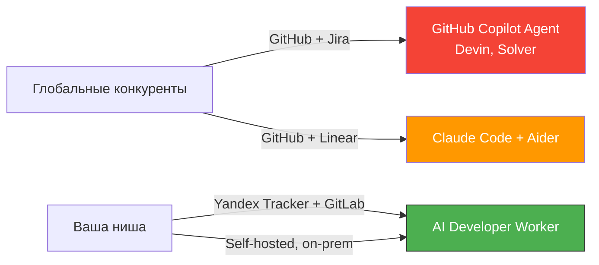
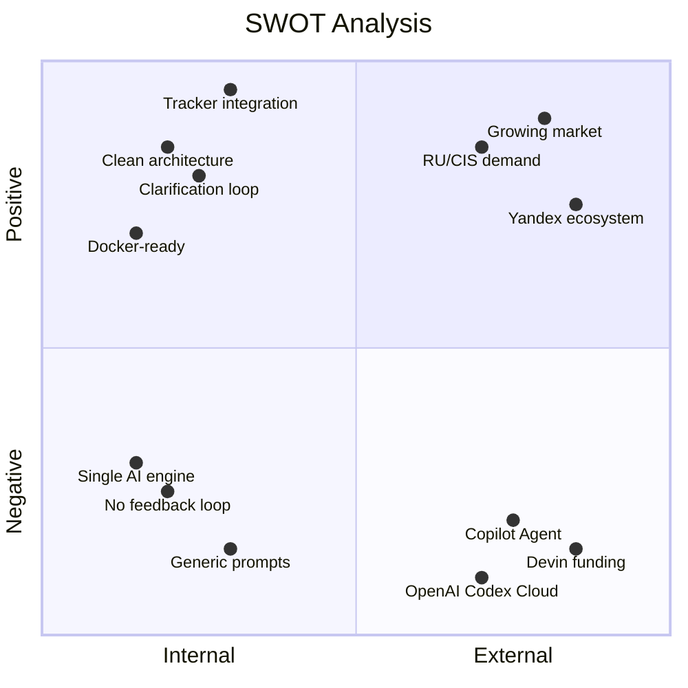

# Перспективы AI Developer Worker — честная оценка

## TL;DR

| Ракурс | Оценка | Вердикт |
|---|---|---|
| Рынок | ⭐⭐⭐⭐ | Рынок огромный и растёт, но перегрет |
| Технология | ⭐⭐⭐⭐ | Архитектура чистая, но core loop — уже commodity |
| Конкуренция | ⭐⭐ | Противостоять гигантам невозможно напрямую |
| Ниша (RU/CIS) | ⭐⭐⭐⭐⭐ | Здесь — реальное конкурентное преимущество |
| Бизнес-модель | ⭐⭐⭐ | Жизнеспособна в нише, не в масштабе |
| Тайминг | ⭐⭐⭐⭐ | Ранний, но окно быстро закрывается |
| Команда/ресурсы | ⭐⭐ | Нужна расстановка приоритетов |

**Главный вывод:** У проекта есть перспективы — **в правильной нише и с правильным позиционированием**. Как прямой конкурент Devin/Copilot Agent — нет. Как нишевый продукт для RU/CIS-команд на Yandex Tracker + GitLab — однозначно да.

---

## 1. 📈 Рынок

### Глобальная картина

Рынок AI-кодинга в 2025–2026 — один из самых быстрорастущих в IT:

- **$6.8B** в 2025 → **$8.5B** к 2026 (CAGR ~24%)
- **76% разработчиков** уже используют или планируют AI coding tools
- **41% кода** в 2025 генерируется AI; к концу 2026 ожидается >50%
- Claude Code — $2.5B annualized revenue; Cursor — $2B ARR

> [!IMPORTANT]
> Рынок существует, огромен и доказан. Это не hype — это реальность, подтверждённая revenue цифрами.

### RU/CIS рынок

- 70%+ российских компаний интегрировали GenAI хотя бы в один бизнес-процесс
- Yandex Cloud ML-сервисы выросли на **160%** за первое полугодие 2025
- 47,000+ клиентов Yandex Cloud; 85% потребления — крупный и средний бизнес
- Yandex Tracker — де-факто стандартный трекер для RU-компаний на Yandex Cloud
- Self-hosted GitLab — стандарт для RU-enterprise из-за требований безопасности

**Вердикт:** Рынок — ✅ безусловно есть. Вопрос в том, *где именно на этом рынке* может играть этот проект.

---

## 2. 🏗 Технология

### Что сделано хорошо

| Аспект | Что есть | Оценка |
|---|---|---|
| Архитектура | Чёткое разделение domain/integrations/utils, интерфейсы для DI | ⭐⭐⭐⭐⭐ |
| Тестируемость | 9 тестовых файлов, включая smoke-тест с mock-серверами | ⭐⭐⭐⭐ |
| Docker-ready | Dockerfile + compose + entrypoint + bootstrap | ⭐⭐⭐⭐⭐ |
| Clarification loop | AI может задать вопрос → человек отвечает → AI продолжает | ⭐⭐⭐⭐⭐ |
| Comment protocol | Структурированный JSON-протокол для коммуникации через Tracker | ⭐⭐⭐⭐ |
| Config validation | Fail-fast при невалидной конфигурации | ⭐⭐⭐⭐ |

### Что создаёт ограничения

| Ограничение | Почему критично |
|---|---|
| Core loop = commodity | Цикл «возьми задачу → вызови AI → прогони тесты → создай MR» уже реализован в 15+ инструментах |
| Промпты — generic | Не адаптируются под проект, не учитывают контекст, не обучаются |
| Один AI engine (Codex) | Lock-in на OpenAI; качество целиком зависит от внешнего API |
| Нет фидбек-лупа | MR создан → дальше руками; воркер не учится на своих ошибках |
| Polling-only | Нет webhook/event-driven; задержка до `POLL_INTERVAL_MINUTES` |

**Вердикт:** Технология — крепкая основа, но **дифференциация через технологию сейчас минимальна**.

---

## 3. ⚔️ Конкуренция

### Прямые конкуренты (автономные AI-разработчики)

| Продукт | Цена | Ключевое отличие | Угроза |
|---|---|---|---|
| **Devin** (Cognition) | $500/мес | Полностью автономная среда (браузер + терминал + редактор) | 🔴 Высокая |
| **GitHub Copilot Agent** | Включён в Copilot ($19/мес) | Автономно создаёт PR из GitHub Issues; 4.7M подписчиков | 🔴 Критическая |
| **Codex Cloud** (OpenAI) | По consumption | Облачная версия того же CLI, что вы используете | 🔴 Критическая — OpenAI сам создал SaaS поверх Codex CLI |
| **Solver** (Laredo Labs) | Enterprise | AI-член команды, обучается на истории проекта | 🟡 Средняя |

### Косвенные конкуренты (AI-ассистенты с растущей автономностью)

| Продукт | Угроза для вас |
|---|---|
| **Claude Code** ($200/мес Max) | Терминальный агент, выполняет задачи end-to-end |
| **Cursor Agent** (Composer) | Многофайловое редактирование + git integration |
| **Windsurf** (Cascade Agent) | Полный pipeline: backend + frontend + тесты |
| **Cline** (VS Code, open-source) | Бесплатный автономный агент с декомпозицией задач |
| **Aider** (open-source) | Зрелый CLI-инструмент, 15+ AI моделей |

### Ключевой вопрос

> Зачем пользователю ваш продукт, если GitHub Copilot Agent **уже включён в подписку** и делает то же самое из коробки?

**Ответ:** Copilot Agent работает только с GitHub Issues → GitHub PR. Ваш продукт работает с **Yandex Tracker → GitLab**. Это и есть ниша.

---

## 4. 🎯 Где реальное конкурентное преимущество

### Нишевое позиционирование: «AI-разработчик для Yandex-экосистемы»

### Три уникальных козыря

**1. Нативная интеграция с Yandex Tracker**
- Маппинг статусов, комментарий-протокол, поиск задач — всё заточено под Tracker API
- Copilot Agent и Devin **не работают** с Yandex Tracker
- Yandex Tracker MCP Server существует, но это raw API — не workflow
- Это не просто «коннектор» — это **orchestration layer** с clarification loop, status management, comment protocol

**2. Self-hosted, код не покидает периметр**
- Для RU-enterprise (банки, госсектор, телеком) это **требование**, а не фича
- Devin — SaaS, код отправляется в облако Cognition
- GitHub Copilot Agent — код на GitHub (не подходит для on-prem GitLab)
- AI Developer Worker — воркер локальный, Codex CLI работает через API, но код не хранится снаружи

**3. Workflow orchestration, не просто AI shell**
- Продукт — это **организатор процесса**, а не AI-движок
- AI-движок заменяем (сегодня Codex, завтра Claude Code или YandexGPT)
- Ценность в **оркестрации**: взять задачу → разобраться → реализовать → провалидировать → опубликовать → отслеживать

---

## 5. 💰 Бизнес-модель: 4 сценария

### Сценарий A: Внутренний инструмент (Internal Tooling)

**Для кого:** Ваша команда / компания.

| За | Против |
|---|---|
| Экономия времени разработчиков | Не масштабируется как бизнес |
| ROI измеряется в dev-hours | Зависимость от одного человека |
| Нет конкурентного давления | Нет revenue |

**ROI-расчёт:**
- Допустим, воркер обрабатывает 3–5 атомарных задач/день
- Средняя задача экономит 1–2 часа разработчика
- = 3–10 dev-hours/день = ~60–200 dev-hours/месяц
- При стоимости dev-hour ≈ 2000–5000₽ → **120K–1M₽/месяц** экономии
- Минус затраты на API Codex (~$50–200/месяц) и инфраструктуру

> [!TIP]
> Как внутренний инструмент — **безусловно оправдан**, если success rate достаточен (>50% задач решаются без правок).

### Сценарий B: Open-Source + Premium

**Для кого:** Сообщество разработчиков.

| За | Против |
|---|---|
| Community adoption, contributions | Revenue только на premium-фичах |
| Маркетинг через GitHub stars | Поддержка community — отдельная работа |
| Дифференциация: «open-source Devin для Tracker» | Конкуренция с Cline, Aider, OpenDevin |

**Что может быть premium:** Dashboard, мультирепозиторность, SLA-очередь, enterprise SSO.

### Сценарий C: Managed Service для RU/CIS

**Для кого:** Компании на Yandex Cloud + Tracker + GitLab.

| За | Против |
|---|---|
| Готовая ниша, понятный ICP | Ограниченный TAM |
| Мало конкурентов в этой нише | Нужна销售 + support |
| Можно партнёриться с Yandex Cloud | Enterprise sales cycle — долгий |

**Ценообразование:** 
- Per-seat: 5000–15000₽/мес за воркера
- Per-task: 200–500₽ за обработанную задачу
- Enterprise: custom pricing

### Сценарий D: SaaS-платформа (глобальный рынок)

| За | Против |
|---|---|
| Огромный TAM ($8.5B) | Конкурируете с Devin ($2B funded), Copilot (Microsoft), Claude Code (Anthropic) |
| Первая платформа с мульти-трекером | Нужна команда 10+ человек |
| | Маркетинговый бюджет несоразмерен |

> [!WARNING]
> Сценарий D — **нереалистичен** без значительного финансирования. Конкуренты имеют 100–1000x больше ресурсов.

---

## 6. ⚠️ Ключевые риски

### Риск 1: OpenAI делает ваш продукт ненужным

OpenAI уже выпустили **Codex Cloud** — SaaS-версию Codex CLI. Если они добавят:
- Интеграцию с GitLab/Tracker (через MCP или напрямую)
- Автоматическое создание MR
- Workflow orchestration

…то core value proposition вашего продукта размывается.

**Митигация:** Абстрагировать AI engine (Фаза 7.3 из roadmap). Ценность должна быть в **оркестрации**, а не в конкретном AI.

### Риск 2: Качество AI-вывода

Продукт целиком зависит от качества Codex CLI. Если Codex начнёт деградировать или станет слишком дорогим:
- Success rate падает
- Стоимость за задачу растёт
- Пользователи теряют доверие

**Митигация:** Мультимодельность, мониторинг success rate, автоматический fallback.

### Риск 3: Промпты не масштабируются

Текущие промпты ([buildImplementationPrompt](file:///c:/Users/gabba/projects/developer/src/domain/promptBuilder.ts#121-145)) — generic. Они работают для простых задач, но:
- Не учитывают архитектуру проекта
- Не знают код-конвенций
- Не помнят прошлые задачи

**Митигация:** Knowledge Base (Фаза 4 из roadmap) — **самая важная фича** для долгосрочного качества.

### Риск 4: Рынок движется быстрее

Каждый месяц появляется 2–3 новых AI coding agent. Время на реализацию roadmap — 6–12 месяцев. К тому моменту ландшафт будет другим.

**Митигация:** Фокус на **нише** (Tracker + GitLab) вместо попытки быть generic product.

---

## 7. SWOT-анализ

| | Положительное | Отрицательное |
|---|---|---|
| **Внутреннее** | **Сильные стороны:** Чистая архитектура, нативная Tracker-интеграция, clarification loop, полный Docker pipeline, хорошие тесты | **Слабые стороны:** Generic-промпты, один AI engine, нет фидбек-лупа, нет контекстной памяти, нет dashboard |
| **Внешнее** | **Возможности:** Растущий рынок ($8.5B), спрос в RU/CIS, экосистема Yandex Cloud, требования к on-prem у enterprise, мало конкурентов в нише | **Угрозы:** Copilot Agent (бесплатно в подписке), Devin ($2B funding), OpenAI Codex Cloud, быстрое развитие конкурентов |

---

## 8. Итоговые рекомендации

### ✅ Что точно стоит делать

1. **Продолжать развивать как инструмент** — даже в минимальном виде он окупается через экономию dev-hours
2. **Стабилизировать (Фаза 0)** — без этого невозможна production-эксплуатация
3. **Замкнуть фидбек-луп (Фаза 1)** — это удваивает ценность
4. **Позиционироваться как инструмент для Yandex-экосистемы** — это реальная ниша

### ⚠️ Что требует осторожности

1. **Не пытаться конкурировать с Devin/Copilot напрямую** — это проигрышная стратегия
2. **Не locked-in на Codex** — абстракция AI engine критична стратегически
3. **Не строить generic product** — ниша > универсальность на этом этапе

### ❌ Что не стоит делать сейчас

1. Разрабатывать SaaS-платформу для глобального рынка
2. Строить свой AI-движок
3. Инвестировать в маркетинг до достижения >70% success rate на реальных задачах

---

## Финальный вердикт

| Вопрос | Ответ |
|---|---|
| Есть ли рынок? | **Да**, огромный и растущий |
| Есть ли ниша? | **Да** — Yandex Tracker + GitLab + self-hosted |
| Есть ли конкуренты в нише? | **Почти нет** — глобальные игроки игнорируют Tracker |
| Жизнеспособен ли продукт? | **Да**, как internal tool или нишевый продукт |
| Стоит ли развивать? | **Да**, но с фокусом на нише, а не на глобальной конкуренции |
| Может ли стать бизнесом? | **Да**, в модели Managed Service для RU/CIS |
| Может ли стать крупным бизнесом? | **Маловероятно** без значительных инвестиций и команды |

> [!NOTE]
> Самый ценный актив проекта — не код, а **понимание workflow**: как задача из Tracker превращается в MR через AI. Код — заменяем. Workflow design + Tracker-интеграция + clarification protocol — это то, что конкуренты не скопируют за один день.
